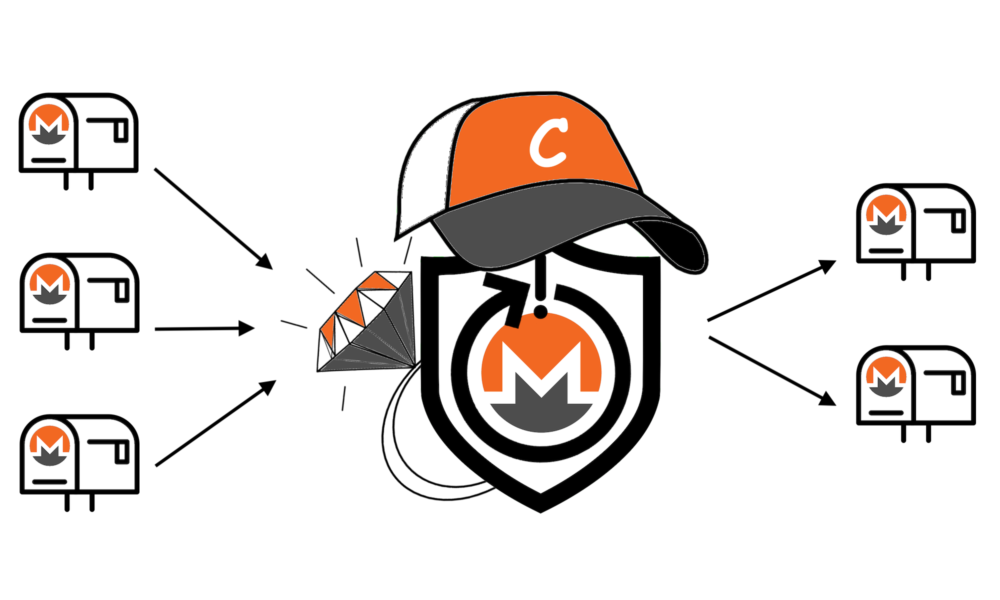

# Monero RingCT Cheatsheet

Based on [Monero Addresses Cheatsheet](https://github.com/baro77/MoneroAddressesCS) and [Rings Cheatsheet](https://github.com/baro77/RingsCS), the third one putting Stealth Addresses and CLSAGs together with Pedersen Commitments and Bulletproofs to obtain the typical Monero transaction (at the time of writing, Q2-2021): RingCT Type 5.

Pending review & -hopefully- approval to be hosted on Library section of Monero's official site via [PR #1655](https://github.com/monero-project/monero-site/pull/1655).

A short introduction describing cheatsheet's strong (if any) and weak points is available in the form of a [companion article hosted on Medium](https://baro77.medium.com/monero-ringct-cheatsheet-8a9fcf580600?source=friends_link&sk=4504b16263b3beb4152498662bd4b9ae).

### Version History

[20210604](https://github.com/baro77/RctCS/blob/main/RctCheatsheet20210604.pdf) - First issue
